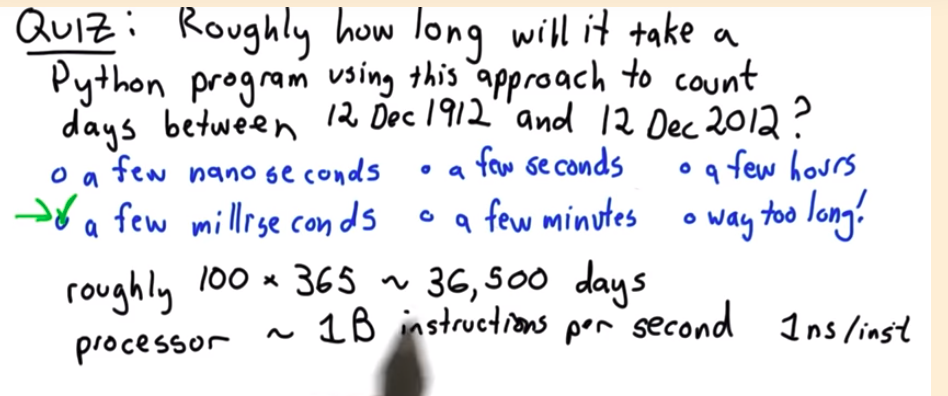

```{r setup, include=FALSE}
knitr::opts_chunk$set(echo = TRUE)
```

# The first thing we should do to solve a problem like this one?

* Make sure we understand the problem 


## Understand a Computational Problem 

1. Problem is defined by a set of possible inputs (set)
2. Relationship between inputs and outputs 

* Solution: 
  + Input --> Procedure --> Output
  


## What are the inputs?
* Given your birthday and the current date, calculate your age in days

  + Input: 2 dates 
    + Second data must not be before first date --> **Defensive Programming**
    
  + How are inputs represented 
    
    
## Pseudo Code of count number of days between 2 dates
 
**Solution 1**
```
days = # of days in month1 - day1
month1 += 1
while month1 < month 2: 
  days += # of days in month 1
  month 1 += 1
days += day2
while year1 < year2:
   days += days in year1

````

* Problem - does not handle 
  + input dates in same month
  + month 2 < month 1
  + counting days in leap years
 
**Solution 2**  
```
days = 0
while date 1 is before date2: 
  date1 = advance to next day 
  days += 1
   

```
    
* Speed of processor 




Typically, a processor can deal with 1 billion instructions per second. (1ns/inst)

each day ~ 1000 instructions

total instructions = 100 * (100 * 365) = 36.5M ~ 36ms = 0.036 seconds


* Summary of problem solving procedure

0. Don't be Panic!
1. What are the inputs?
2. What are the outputs?
3. Work through some examples by hand 
4. Simple machanical solution 

5. Don't optimmize prematurely! Simple and correct


