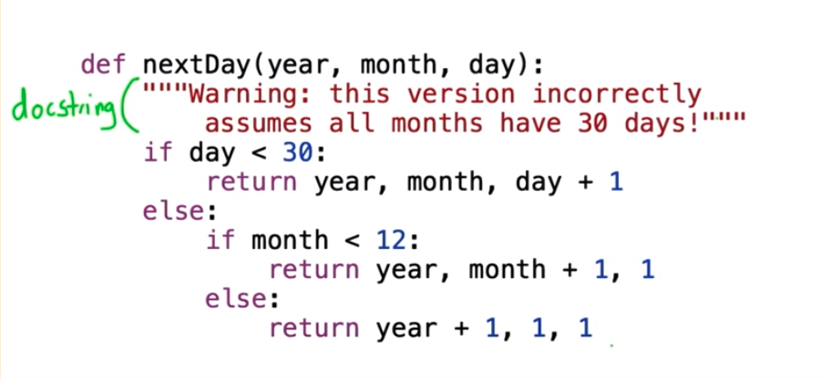
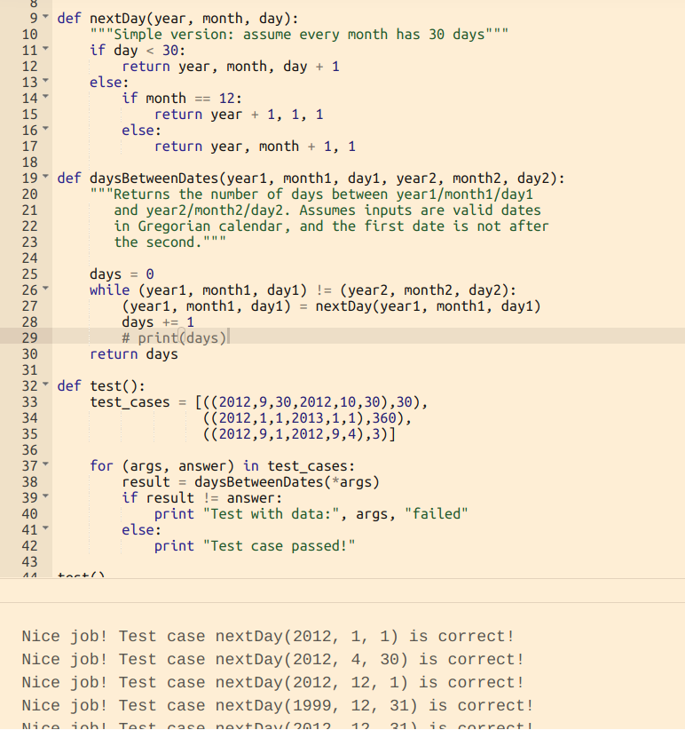
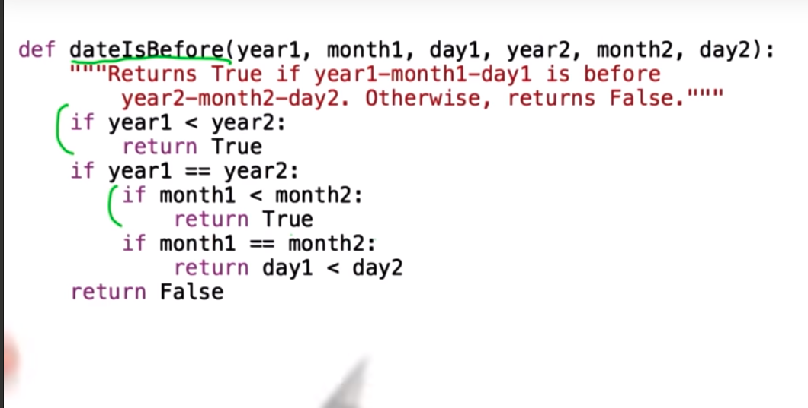
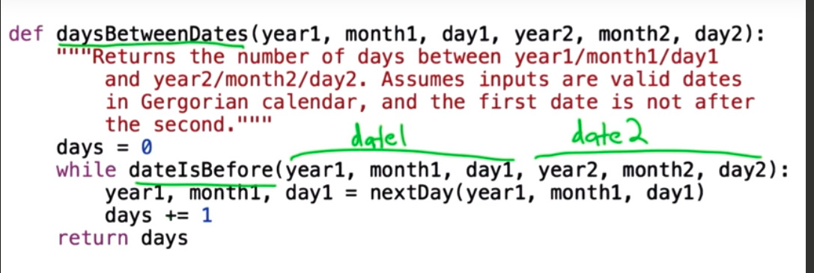
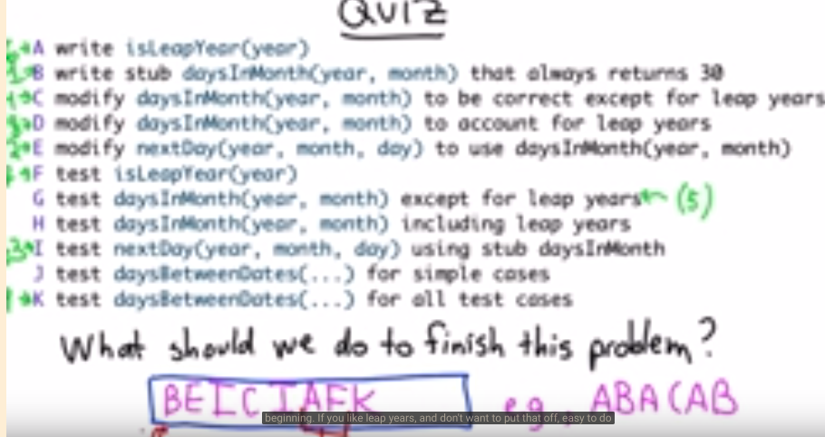

```{r setup, include=FALSE}
knitr::opts_chunk$set(echo = TRUE)
```

# The first thing we should do to solve a problem like this one?

* Make sure we understand the problem 


## Understand a Computational Problem 

1. Problem is defined by a set of possible inputs (set)
2. Relationship between inputs and outputs 

* Solution: 
  + Input --> Procedure --> Output
  


## What are the inputs?
* Given your birthday and the current date, calculate your age in days

  + Input: 2 dates 
    + Second data must not be before first date --> **Defensive Programming**
    
  + How are inputs represented 
    
    
## Pseudo Code of count number of days between 2 dates
 
**Solution 1**
```
days = # of days in month1 - day1
month1 += 1
while month1 < month 2: 
  days += # of days in month 1
  month 1 += 1
days += day2
while year1 < year2:
   days += days in year1

````

* Problem - does not handle 
  + input dates in same month
  + month 2 < month 1
  + counting days in leap years
 
**Solution 2**  
```
days = 0
while date 1 is before date2: 
  date1 = advance to next day 
  days += 1
   

```
    
* Speed of processor 


Typically, a processor can deal with 1 billion instructions per second. (1ns/inst)

each day ~ 1000 instructions

total instructions = 100 * (100 * 365) = 36.5M ~ 36ms = 0.036 seconds


* Summary of problem solving procedure

0. Don't be Panic!
1. What are the inputs?
2. What are the outputs?
3. Work through some examples by hand 
4. Simple machanical solution 

5. Don't optimize prematurely! Simple and correct





** Quiz









* After defining rough nextDay we should directly jump in to define daysBetweenDates before we go back to refine the code 


## Steps of solving a problem 



1. Write stub daysInMonth(year, month) that always returns 30 
2. Modify nextDay(year, month, day) to use daysInMonth(year, month)
3. Test nextDay(year, month, day) using stub daysInMonth
4. Modify daysInMonth(year, month) to be correct except for leap year
5. Test nextDay(year, month, day) using stub daysInMonth
6. Write isLeapYear(year)
7. Test isLeapYear(year)
8. Test daysBetweenDates(...) for all test cases


```{python}
# Credit goes to Websten from forums
#
# Use Dave's suggestions to finish your daysBetweenDates
# procedure. It will need to take into account leap years
# in addition to the correct number of days in each month.
def isleapYear(year):
    if year % 400 == 0:
        return True
    if year % 100 == 0:
        return False
    if year % 4 == 0:
        return True
    return False

def daysInMonth(year,month):
    if month == 1 or month == 3 or month == 5 or month == 7 or month == 8 \
    or month == 10 or month == 12:
        return 31
    else:
        if month == 2:
            if isleapYear(year):
                return 29
            else:
                return 28
        else:
            return 30
        
def nextDay(year, month, day):
    """Simple version: assume every month has 30 days"""
    if day < daysInMonth(year, month):
        return year, month, day + 1
    else:
        if month == 12:
            return year + 1, 1, 1
        else:
            return year, month + 1, 1
        
def dateIsBefore(year1, month1, day1, year2, month2, day2):
    """Returns True if year1-month1-day1 is before year2-month2-day2. Otherwise, returns False."""
    if year1 < year2:
        return True
    if year1 == year2:
        if month1 < month2:
            return True
        if month1 == month2:
            return day1 < day2
    return False        

def daysBetweenDates(year1, month1, day1, year2, month2, day2):
    """Returns the number of days between year1/month1/day1
       and year2/month2/day2. Assumes inputs are valid dates
       in Gregorian calendar."""
    # program defensively! Add an assertion if the input is not valid!
    assert not dateIsBefore(year2, month2, day2, year1, month1, day1)
    days = 0
    while dateIsBefore(year1, month1, day1, year2, month2, day2):
        year1, month1, day1 = nextDay(year1, month1, day1)
        days += 1
    return days
    #assert daysBetweenDates(2013,7,23,2014,7,23) == 365

def test():
    test_cases = [((2012,1,1,2012,2,28), 58), 
                  ((2012,1,1,2012,3,1), 60),
                  ((2011,6,30,2012,6,30), 366),
                  ((2011,1,1,2012,8,8), 585 ),
                  ((1900,1,1,1999,12,31), 36523),
                  ((2013,7,23,2014,7,23),365)]
    
    for (args, answer) in test_cases:
        result = daysBetweenDates(*args)
        if result != answer:
            print "Test with data:", args, "failed"
        else:
            print "Test case passed!"

test()
```


