```{r setup, include=FALSE}
knitr::opts_chunk$set(echo = TRUE)
```

# Space and Time 
* When we refre to the efficiency of a program, we are not just thinking about its speed: 
  + time 
  + space
  
# Algorithms

* An algorithm is essentially a series of steps for solving a problem. Usually, an algorithm takes some kind of input and then produces the desired output.

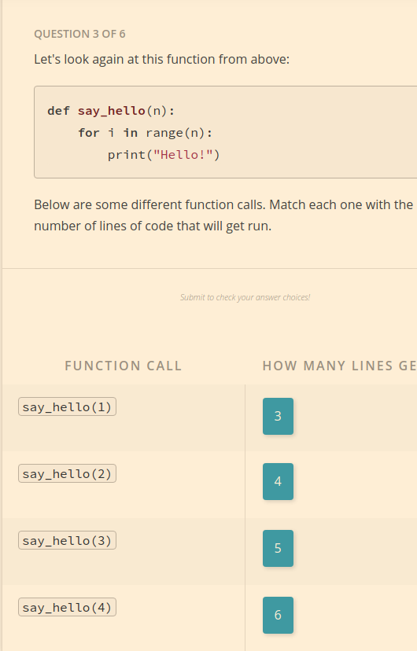

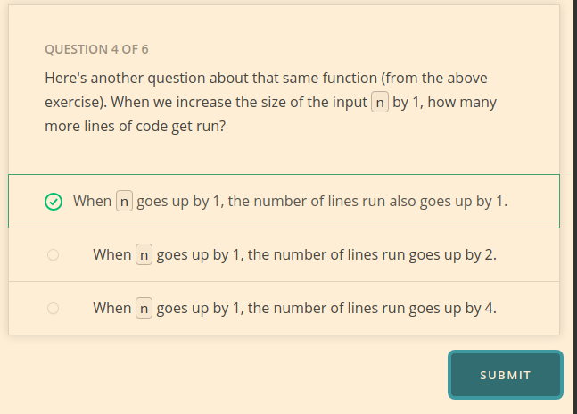


* As the input to an algorithm increases, the time required to run the algorithm may also increase - and different algorithms may increase at different rates.

# Order
When peoploe refer to the rate of an algorithm, they will sometimes instead use the term *order*,

  + The rate of increase of an algorithm is also refered to as the order of the algorithm 
  
  + Big O Notation: O in the name refers to the order of the rate of increase.
  
  
  
# Efficiency Practice
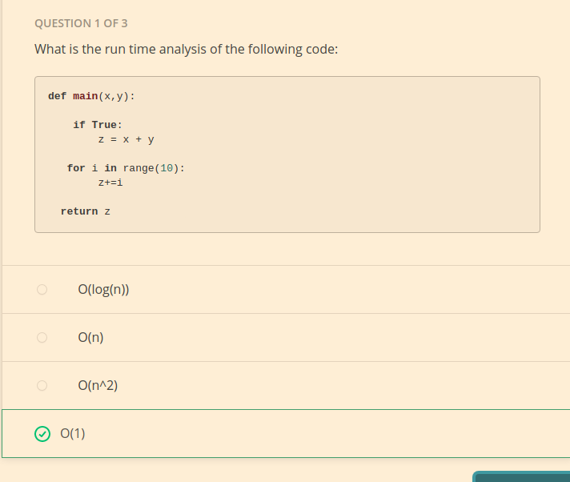


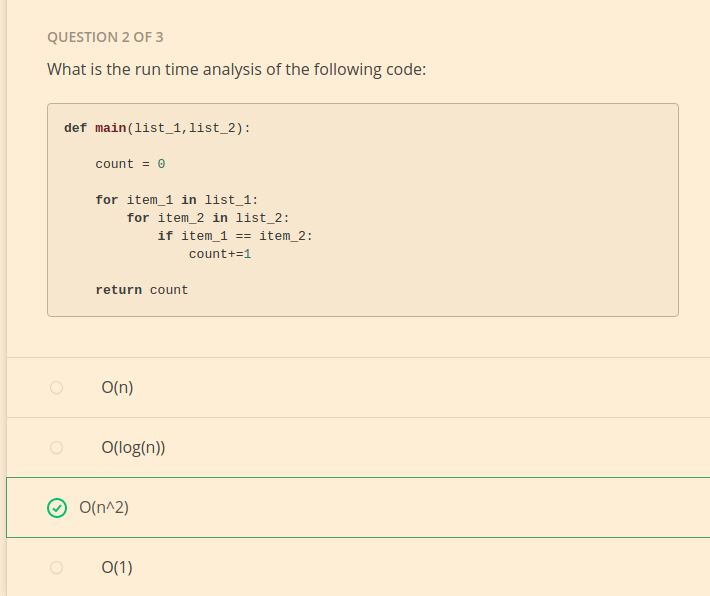


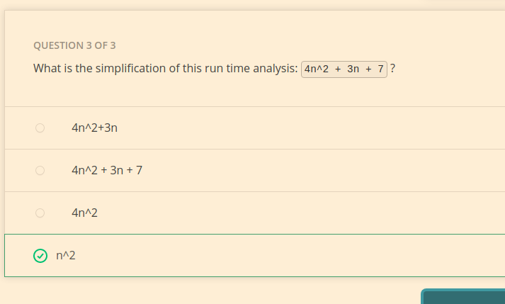

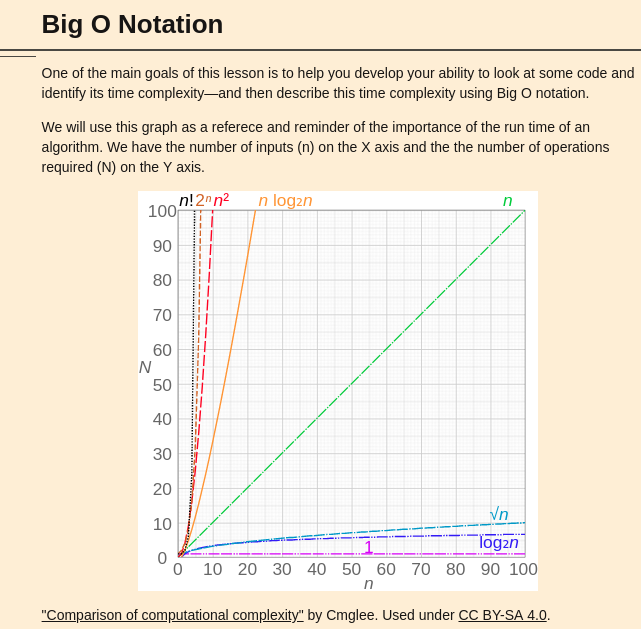
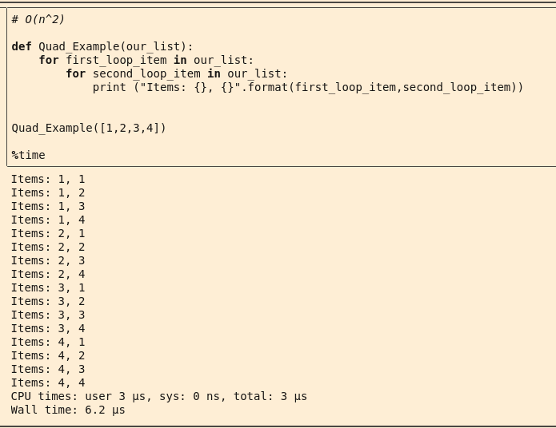
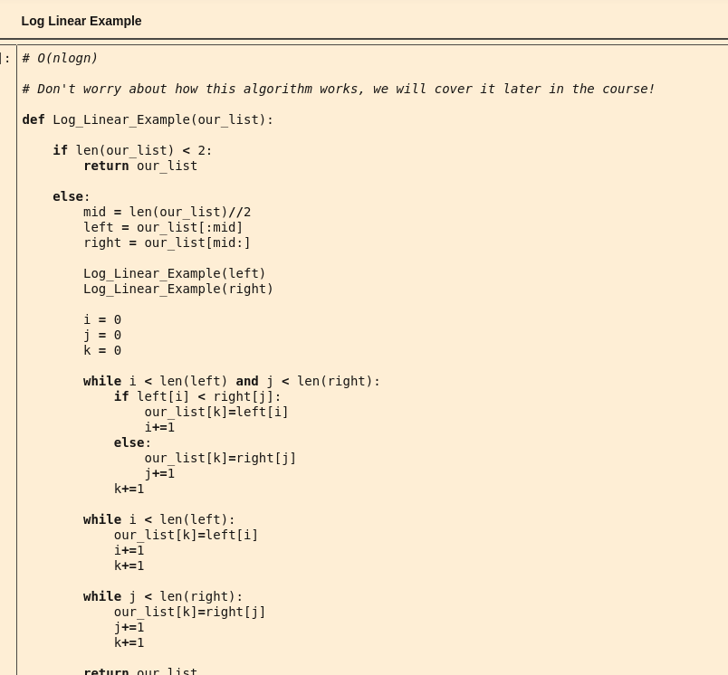

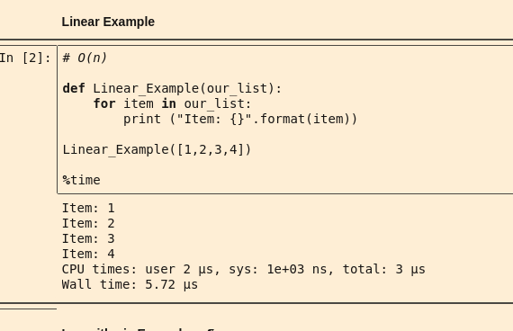


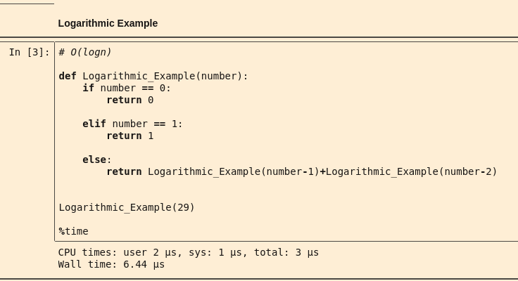

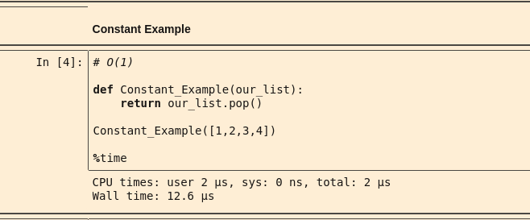


# Space Complexicity 

* When we refer to *space complexity*, we are talking about how efficient our algorithm is in terms of memory usage. 

This comes down to the datatypes of the variables we are using and their cllocated space requirements. 

In Pyhon, it's less clear how to do this to the underlying data structures using more memory for house keeping functions. 

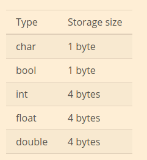


